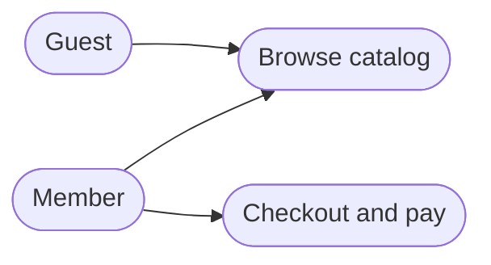
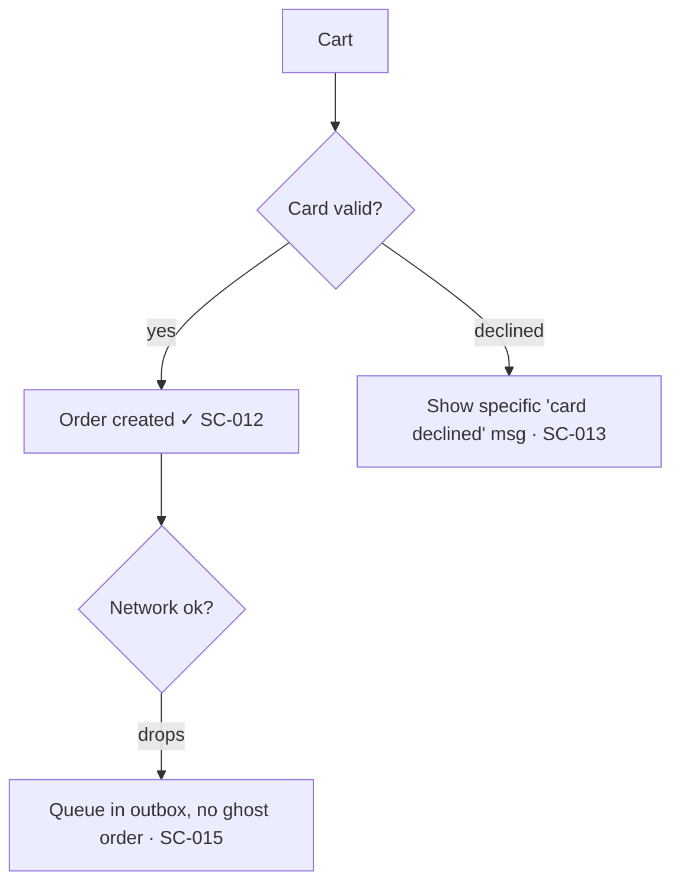

---
paths:
  - "**/specs/**"
  - "**/spec*.md"
  - "**/tasks*.md"
  - "**/plan*.md"
  - "**/SCENARIOS.md"
---

# Scenario map rule (`specs/SCENARIOS.md` + `specs/scenarios/` — the living exploded view)

Every project keeps a living **scenario map** rooted at `specs/SCENARIOS.md` — an exploded view ("sprängskiss") of every conceivable scenario and use case across the whole project. It is the source from which the rest of the pipeline is derived:

- **Happy-path scenarios** → the functional-coverage inventory (one test per happy scenario).
- **Edge / adversarial / error scenarios** → the destructive E2E suite (Playwright/Maestro) and the risk-tiered count.
- **Invariants implied by the scenarios** → Allium `rule`/`invariant` entries.

The map answers one question at a glance that nothing else in the pipeline answers: *"have we thought of everything yet?"* It is a **surveyable, visual artifact** — not just a ledger of rows. It grows with the project — it is never "finished".

### Two layouts — one file, or an index plus feature files

Because it never stops growing, the map has two legitimate shapes. Which one a project is in is a
question about size, not taste, and every consumer detects it rather than assuming:

| | **Single-file** (the default) | **Split** (a project that outgrew one file) |
|---|---|---|
| `specs/SCENARIOS.md` | everything: use-case diagram, every flowchart, every SC row, history | use-case diagram, actor headings, a **per-feature index**, history |
| `specs/scenarios/<slug>.md` | does not exist | one file per feature: its flowchart, its SC rows, its validation prose |
| Read per spec | the whole map | the index, plus the one feature file being worked |

**Detection is `specs/scenarios/` existing and being non-empty.** An empty directory counts as
single-file — it is what a half-finished split or a stray `mkdir` leaves behind, and reading it as
split would send every consumer looking for rows where there are none. `scripts/scenario-map-layout.sh`
is the one implementation of that predicate; hooks source it rather than re-deciding, because two
hooks disagreeing about where the rows live is worse than either being wrong, the disagreement being
silent.

**When to split:** when the map passes the context-cost canary (25 KB) and targeted reads have stopped
being comfortable. Not before — a small map is *better* in one file, and 41 of this template's 42
projects are correctly single-file. Split as a deliberate refactor with its own spec, noted in Scenario
history; the layout change is not a cleanup you do in passing while working another feature.

## What the map contains — visual overview (tiered), backed by the SC-id ledger

The map is **diagram-led**. The visual artifacts give the bird's-eye view; the SC-id table is the detailed backing that drives tests. Diagrams are **Mermaid** (renders in GitHub / VS Code / Obsidian, diffable, lives next to the code). Every diagram's nodes/steps carry the `SC-id`s so the picture and the ledger stay in lockstep.

**Always (every project / behaviour-changing feature):**
- **Use case diagram** — project-level overview of *who can do what*. Mermaid `flowchart LR`: actors as plain nodes, use cases as stadium `([…])` nodes.
- **User flow / flowchart** — one per feature: steps + decision diamonds + the error/empty branches. Mermaid `flowchart TD`. This is the workhorse — the branches ARE the scenarios.
- **SC-id table** — the detailed ledger (every happy/edge/adversarial/error row + validation status).

**On-demand (when it adds value):**
- **Journey map** — for key end-to-end journeys. Mermaid `journey` (stages, actions, satisfaction per touchpoint).
- **Wireflow** — when screens exist: a `flowchart` whose nodes are *screens*, each optionally linking to a Figma / Claude Design frame.
- **Storyboard** — for novel/complex UX: a numbered frame sequence (or `sequenceDiagram`) telling one user's narrative.

## Format

````markdown
# Scenario map

Living, surveyable exploded view of every scenario. Append as the project grows; never reuse an SC-id.
Status:  ☐ mapped  ·  ◐ tested  ·  ✓ validated (proven to actually work at runtime)

## Use case overview (who can do what)



## Actor: Member

### Feature: Checkout   (spec: 003-checkout)

User flow:



| ID     | Type        | Scenario                              | Expected outcome                          | Status |
|--------|-------------|---------------------------------------|-------------------------------------------|--------|
| SC-012 | happy       | Pay with a valid card                 | Order created, receipt shown              | ✓      |
| SC-013 | error       | Card declined                         | Specific, visible "card declined" message | ✓      |
| SC-014 | adversarial | Double-submit the pay button (race)   | Exactly one order (idempotent)            | ◐      |
| SC-015 | error       | Network drops mid-payment             | Queued in outbox, no ghost order          | ☐      |
| SC-016 | offline     | Pay while offline, reconnect later    | Sync on reconnect, single order           | ☐      |

<!-- On-demand: add a ```mermaid journey``` for the key end-to-end journey, a wireflow
     (flowchart of screens, linking design frames), or a storyboard for novel UX. -->

## Scenario history
- 2026-06-15 — initial map seeded from spec 001
````

- **SC-id** — `SC-NNN`, three digits, globally unique, **never reused** even if a scenario is deleted (strike it through, keep the id). The same id appears in the flowchart node and the table row.
- **Type** — one of `happy` · `edge` · `adversarial` · `error` · `offline` (extend only with good reason).
- **Status** — `☐ mapped` (written down) → `◐ tested` (a test exists) → `✓ validated` (the test exercises the REAL behaviour and it actually works at runtime). Only `✓` counts as done.
- Group by **actor**, then **feature**, and tag each feature block with the owning spec (`NNN-slug`). The use-case diagram sits above the actors as the project overview.

## Cross-linking (traceability both ways)

- `spec.md` references the SC-ids it covers; `tasks.md` test tasks cite them.
- Test names embed the id: `Checkout_SC014_DoubleSubmit_CreatesOneOrder`, `checkout-SC014-double-submit-destructive.yaml`.
- Allium `rule`/`invariant` entries that formalize a scenario name its SC-id in a comment.

This gives a clean chain: **SC-014 → destructive test → Allium invariant → TLA+ check**. When `/tla` finds a gap, you can trace it straight back to the scenario it came from (or discover the scenario was never written down — which is itself the finding).

**The chain is checked, in both directions, by `scripts/validate-scenario-traceability.sh`.** It reports:

- **uncovered** — a row whose Status claims `✓` or `◐` while no test under `tests/` names its id. The map says the scenario is proven and the suite has never heard of it. This is a gate failure, not a matter of taste: a status is a claim about the suite, and a claim nothing backs is the thing the status was invented to prevent.
- **dangling** — an id a test names that is not a row in the map. A typo, or a row deleted out from under a test.

**A retired row's status is `—`, and the proof it earned goes in its text.** A row struck through
(`~~SC-nnn~~`) has one true current state — retired — and the status column is the cell every gate
reads and every tally counts. Leaving the `✓` it had earned there means the map shows a validated
scenario that no longer exists, and the reader has to notice the strike to know otherwise. The
history is worth keeping, so keep it where it reads as history: `— **Superseded by spec N.**
_(retired; had been ✓ before it was superseded.)_ | — |`. The rejected alternative was to relax the
invariant instead and let a retired row keep its old status; that keeps one sentence of history at
the price of every count downstream being ambiguous, which is the wrong trade for the column the
machinery consumes. `scripts/test-scenario-map-index.py` enforces this: status is `—` exactly when
the row is struck.

**Two `SC-` namespaces exist, and only arithmetic keeps them apart.** spec-kit's spec template
numbers a spec's Success Criteria `SC-001`, `SC-002`, … — the same prefix this map uses for
permanent handles. A test citing its own spec's criteria is therefore indistinguishable from a test
citing a scenario that does not exist, and `validate-scenario-traceability.sh` reports references
below the map's lowest id in a separate **out-of-range** bucket rather than as dangling. That split
is a floor, not a fix: it holds only while no spec numbers a criterion up into the map's range, and
that has already happened at least once. When you write a spec, prefer letters for its Success
Criteria (`SC-A`, `SC-B`) or reuse the map ids the spec actually claims — do not start a second
numeric sequence under the same prefix.

**A `☐ mapped` row is exempt from the coverage direction.** Mapped-not-yet-tested is the correct state for every scenario of every unbuilt spec, and counting it as a failure would leave the gate permanently red on any project with a roadmap — which is how a gate stops being read. A **retired** (`~~SC-nnn~~`) row is exempt too, but its id still counts as real for the dangling check: the id is a permanent handle, so a test still naming it is stale, not wrong about the map.

The figure is reported with **both numbers** (`122 of 150`), never as a bare percentage, and `scripts/project-maintenance.sh` prints it on every pass without failing the run — uncovered scenarios are a backlog, dangling ones are a defect and do fail it.

For most of this project's life nothing checked either direction, while four comments in `scripts/` cited a traceability script by name as having "reported 100% and exit 0". No such script existed. That is why the gate ships with `scripts/test-validate-scenario-traceability.sh` and a sabotage arm: a gate nobody has watched fail is a report, not a gate. (Spec 007bs.)

## When to update (continuous, every spec)

The map is touched during **every** behaviour-changing spec, as part of the pipeline (not a separate task):

1. **At spec time** (`/speckit-specify` + `/speckit-clarify`) — add the new feature's actors/scenarios: extend the use-case diagram, draw the feature's user-flow flowchart, and add the table rows. Clarify questions that surface a new edge case become a new branch in the flowchart AND a new `edge`/`error` row.
2. **At elicit time** (`/allium:elicit`) — every invariant should trace to at least one scenario; if it doesn't, add the scenario.
3. **At test time** — the happy rows become functional tests, the edge/adversarial/error rows become the destructive suite. A destructive test with no SC-id means the scenario was never mapped — add it.
4. **At `/tla` time** — counterexamples and gaps are new scenarios; add them with type `adversarial`/`error` so the next feature inherits the lesson.

Updating the map is part of "done" for the spec, the same way ticking the spec register is.

## Keep the map lean — read it targeted (BLOCKING — context-cost hygiene)

The map is the artefact most likely to balloon, because it grows with *every* behaviour-changing spec and the rule above says to touch it every time. Under the split layout the growth lands in a feature file rather than the index, which is why the canary measures each of them and not just the index. "Surveyable" means a human can skim the diagrams — it does **not** mean you reload all 1000+ lines into context on every spec. On a mature project this single file can be 40k+ tokens; swallowing it whole each spec is the biggest avoidable per-spec cost. Discipline:

- **Read only the slice you need.** When you touch the map for feature X, load only that feature's flowchart + its SC-id rows. You almost never need the whole map at once — the use-case diagram and other features' ledgers are not inputs to the spec in front of you. The recipe depends on the layout:
  - **Split** — read `specs/SCENARIOS.md` (small by construction) to find the feature's row, then open its `specs/scenarios/<slug>.md` whole. To go straight from an id: `grep -rn 'SC-047' specs/SCENARIOS.md specs/scenarios/` names both the index row and the file that owns it.
  - **Single-file** — `grep -nE 'Feature: <name>|SC-0[0-9]{2}' specs/SCENARIOS.md` to locate the block, then `Read` with `offset`/`limit` around it. Never a whole-file read.
- **Edit surgically.** Add the new feature's rows/flowchart with `Edit` at the right location; do not read-and-rewrite the entire map to append a few rows.
- **History is one line each, and it gets archived.** `## Scenario history` entries are `- YYYY-MM-DD — <one sentence>`, never paragraphs. When the section passes ~5 entries, move the older ones to `specs/SCENARIOS.history.md` (never read in-flight) with `scripts/archive-spec-history.sh`.
- **An entry that stays inline is budgeted at 300 bytes** (`archive-spec-history.sh --max-bytes N`, `0` disables; over budget is exit 4, which reports without blocking the archiving). The budget does not replace "one sentence" — it is the measurable floor under it, because sentence-counting over prose full of file paths and `e.g.` is a heuristic and bytes are not. 300 is calibrated, not chosen: it is the smallest round number above the 95th percentile of the entries in this project that already comply. The **archive is exempt** — it is never read during the pipeline, so its entries cost nothing. This exists because `--keep` only ever controlled how MANY entries stayed inline: on 2026-08-28 three of the seven entries here ran 2,075, 2,634 and 2,925 bytes — nine to twelve sentences each, 88% of the section — and passed every check the project had, because each was one line and a markdown bullet has no length limit.
- **The history heading declares which end is newest** — `## Scenario history (newest first)`, or `(newest last)`. The archiver keeps whichever end holds the newest entries, so a wrong answer archives the entry most likely to be read next. It takes the declaration when there is one, infers from the date trend only when that trend is decisive, and otherwise moves nothing and exits 5 (row H7bb — the old inference read "first entry's date greater than the last entry's", which is false whenever every inline entry shares a date, and it archived the newest entry while reporting that it kept it).
- **When a project's map genuinely outgrows one file** (many actors × many features, and even targeted reads are awkward), split it per the table above. One file per **feature block**, named for its primary spec slug; a `####` sub-feature travels inside its parent's file rather than earning one of its own, because it was written as one narrative. The index keeps the use-case diagram and one row per feature: name, spec slug(s), a link, its SC-id range, and a tally of live rows with retired ones named separately. Do it as a deliberate refactor with its own spec (note it in Scenario history), never silently.
- **Moving the map is a move, not an edit.** Restructuring must not reword, re-type, re-status or drop a single row, and a retired `~~SC-nnn~~` row must survive struck through — tidying one away frees an id that is a permanent handle. Prove it mechanically: snapshot every row before, extract after, diff. `scripts/scenario-map-rows.sh` and `scripts/test-scenario-map-split.sh` are that pair. Eyeballing a 188-row diff is not a check.
- **The index must not drift from the files it summarizes.** Splitting buys a cheap per-spec read and creates a failure mode one document could not have: the index's per-feature status tally goes stale the moment a spec flips a `◐` to `✓` in a feature file and does not touch the index, and nothing else notices — the row count is unchanged, the losslessness gate passes, the canary is silent. `scripts/test-scenario-map-index.py` checks nine such invariants against the real map. **Updating a scenario's status is two edits, not one**: the row in its feature file, and that feature's tally in the index.
- **The canary measures every file the map is made of.** Under the split layout `scripts/spec-register-orientation-hook.sh` and `scripts/project-maintenance.sh` measure the index *and* each feature file separately, naming every one over 25 KB. They never sum them: nothing reads all the feature files in one spec, so a sum would fire permanently on a map behaving exactly as designed, and a warning that is always on is a warning that is off.

None of this weakens the "map everything / never invent silently" rules below — it changes *how much you load to work on the map*, not *what the map must contain*.

## Post-implementation validation (BLOCKING — every scenario must actually WORK)

Allium and TLA+ harden the **spec**. They prove nothing about whether the **implementation** runs. After every implementation, each scenario must be validated at runtime — a `✓` in the map means the behaviour was *observed working*, not merely that a test file exists. This is the runtime mirror of the spec-side rigor: the spec can be perfect and the login still ship with no error message.

**A scenario is `✓ validated` only when:**

1. A test **exercises the real behaviour end-to-end** — it drives the actual UI / calls the real endpoint and asserts the real outcome. A test that asserts on a stub, never invokes the function, or only checks "the page rendered" does NOT validate the scenario (this is the documented AI-test failure mode — high coverage, zero bite; the mutation gate is the backstop).
2. **All four UI states are real and present** for every interactive/async scenario — a missing one is a failed validation, not a polish item:
   - **Success** — the thing actually happens (click the map → the pin/sheet/action fires; submit → the record is created).
   - **Error** — a **specific, visible** message. Never silent, never a blank screen, never a raw stack trace. A failed login MUST say *why* (wrong password / locked / network) — "never a missing error message" is the canonical example of this rule.
   - **Empty** — zero results shows a real empty state, not a blank void.
   - **Loading** — feedback during async, and it must resolve (no infinite spinner).

**Critical-path-first ordering (why a broken prerequisite is a hard stop):**

Validate foundational scenarios **before** the ones that depend on them. If you cannot log in, every scenario behind auth is untestable — a green suite below a broken prerequisite is meaningless. So:

- Smoke the critical path first (can you authenticate? does the primary interaction fire?), then fan out to the deeper scenarios.
- If a prerequisite scenario fails validation, **STOP and fix it before continuing** — it invalidates everything downstream. Do not write 90 destructive tests for a checkout that can't be reached because the map click does nothing.
- Mark the dependency in the map when it isn't obvious (e.g. note that SC-040..060 all sit behind SC-001 login).

Update each scenario's **Status** where its row lives — the feature file under the split layout, `specs/SCENARIOS.md` under the single-file one — as it moves `☐ → ◐ → ✓`. Under the split layout also refresh that feature's tally in the index, or the index starts lying about project-wide progress. The spec/feature is not done until its scenarios are `✓`. A `/tla` or Allium finding that traces to a scenario also flips that scenario back below `✓` until re-validated.

## Scenario gap or drift → START AN INTERVIEW (BLOCKING — do not paper over it)

Missing user-cases are the root cause of "we forgot that in the code". A scattered reminder is not enough — when the scenario map is **incomplete** or a spec/implementation has **drifted** from it, Claude MUST stop and run a **scenario interview** to capture the missing cases *before* continuing. This is a legitimate stop under `continuous-execution.md` (genuine missing requirements), and it is the only safe response to a gap.

**Triggers — any one of these starts the interview:**

1. **No map yet** — `specs/SCENARIOS.md` does not exist and the current spec has interactive behaviour.
2. **Unmapped behaviour** — a `spec.md` / `tasks.md` describes an actor, feature, or flow that has no corresponding rows in the map.
3. **Test/code drift** — a destructive test, functional test, or implementation references a scenario (an `SC-id` or a behaviour) that is not in the map, OR a mapped scenario has no implementation/test.
4. **Allium / TLA+ drift traceable to a missing scenario** — `/allium:distill` or `/tla` surfaces behaviour with no SC-id behind it (per `validation-followup.md`, each such finding is a scenario to add).

**The interview (use `AskUserQuestion`, one feature at a time):**

- For each actor × feature, ask the user to confirm or fill the four scenario classes: **happy**, **edge**, **adversarial** (race/double-submit/tamper), **error** (network/timeout/auth-expiry), plus **offline** where relevant.
- Pair every question with a **recommended answer** derived from the spec and the codebase — the user confirms or corrects, they don't start from a blank page. (Single-model self-assessment of "did I cover everything?" is weak; the interview makes the human the completeness check.)
- Keep going until the user signals the feature's scenarios are complete, then write them into the map as BOTH the visual artifacts and the ledger — into the feature's own `specs/scenarios/<slug>.md` under the split layout, into `specs/SCENARIOS.md` under the single-file one: update the project **use-case diagram** if a new actor/use case appeared, draw/refresh the feature's **user-flow flowchart** (every branch is a scenario, error/empty branches included), add the new `SC-id` rows to the table, and append a line to **Scenario history** noting what the interview added and why. A scenario that exists as a row but not in the flowchart isn't surveyable — put it in both.
- Only then resume the pipeline. The newly-captured scenarios immediately feed the functional inventory and the destructive suite.

Do NOT silently invent the missing scenarios and move on — inventing them is the same failure as missing them, just hidden. Ask.

## Enforcement

- **PostToolUse reminder** (`scripts/scenario-map-reminder-hook.sh`, advisory — never blocks): fires when a `spec*.md` / `tasks*.md` / `plan*.md` gains interactive behaviour but the map lacks rows for it — searching the index **and** every `specs/scenarios/*.md`, so a feature mapped in a feature file is not reported as a gap. The reminder explicitly instructs Claude to **start the scenario interview above**, not merely to jot a note. The hook is silent on template/scratch repos (no language marker) and on non-behaviour specs.
- The map is seeded by `/project-wizard` at project inception (the inception interview is the first scenario interview) and grows from there.
- Drift detection rides alongside Allium/TLA+: the scenario map is the human-readable layer above the Allium baseline, so `/tla`'s drift report and the scenario map stay in lockstep.

## What this rule forbids

- Writing a destructive test for a scenario that isn't in the map (map it first, or as you write the test).
- Treating the map as write-once — it is a living document; a spec that adds behaviour and leaves the map untouched is incomplete.
- Reusing an `SC-id`. Ids are permanent handles for traceability.
