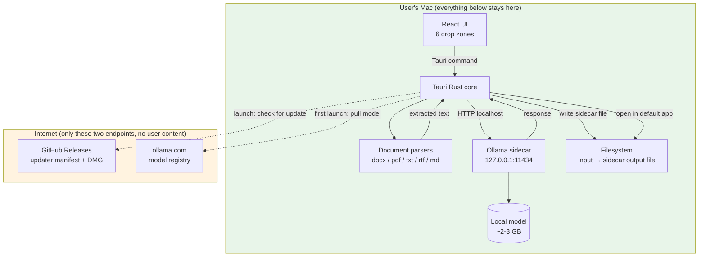

# JuraDrop

> A macOS desktop utility that lets Swedish law students translate, summarize, anonymize, and rewrite confidential legal documents using a local LLM — **without document content ever leaving the Mac**.

## Problem

Law students routinely work with confidential documents: case material from internships, ongoing-litigation drafts from mentors, sensitive client correspondence assigned as coursework. The fastest way to "ask an AI to summarize this" today is to paste the document into ChatGPT or Claude.ai — and that uploads the text to a third party, often violates client confidentiality, and may breach Swedish data protection law (`OSL`, GDPR Art. 9 special-category data).

The alternatives are worse:
- **Don't use AI at all** — students miss out on a clear productivity win.
- **Install Ollama from the command line** — works for ~5% of law students who have ever opened Terminal.
- **Pay for a Pro tier with "data isn't used for training" toggles** — the data is still uploaded, the policy is still revocable, and €20/month is a lot for a student.

JuraDrop closes the gap: a normal-looking Mac app that runs an LLM locally and never phones home with your document.

## Target Users

| Persona | Role | Tech savvy | Frequency |
|---|---|---|---|
| **Emma, 21** | Third-year law student at Uppsala. Drafting an essay on `förvaltningsprocesslagen`. | Low — uses Mac, has never opened Terminal. | Weekly |
| **Anders, 24** | Notarie at a court, finishing his last term remotely. Confidential rulings cross his desk daily. | Medium — knows what a `.docx` is, refuses to install dev tools. | Daily |
| **Lina, 19** | First-year law student. English isn't her first language; struggles with English textbooks. | Low — born after the iPhone. | Daily |

All three share: a Mac, no Terminal experience, a high tolerance for "drag this here" interactions, and zero tolerance for setup wizards that ask for an API key.

## Core Modules

**The window has six drop zones (v1.0):**

| Label (Swedish) | What happens | Example use |
|---|---|---|
| **Till engelska** | Translate Swedish doc → English | Translating Swedish case summary for an exchange-student study group |
| **Till svenska** | Translate English doc → Swedish | Translating an English law textbook chapter |
| **Sammanfatta** | Produce a condensed summary in the same language | TL;DR of a 40-page court ruling |
| **Punktlista** | Extract key points as bullets | Lecture-note prep from a long judgment |
| **Anonymisera** | Replace personal names, addresses, personnummer with `[Person 1]`, `[Adress 1]`, `[Personnr 1]` | Sharing a draft with classmates without exposing client identity |
| **Förenkla** | Rewrite legalese in plain Swedish | Helping a first-year understand what `inhibition` actually means |

Future zones (v1.1+, easy additions): `Citatextraktion` (pull quotes), `Quizfrågor` (exam-style questions), `Begreppslista` (glossary of legal terms), `Översättningsförklaring` (translation with footnotes explaining legal-system differences).

## Tech Stack

| Layer | Technology | Rationale |
|---|---|---|
| Application framework | Tauri 2.x (Rust + WKWebView) | Smallest signed `.app`, native file APIs, sidecar process management for Ollama, MIT license |
| Frontend | React 18 + TypeScript + Tailwind CSS + shadcn/ui | Familiar stack, fastest path to a polished UI, matches other Johan projects |
| State | TanStack Query + Zustand | Boring, proven, no surprises |
| LLM runtime | Ollama (bundled sidecar) | Local, free, fast on Apple Silicon, simple HTTP API |
| Default model | `gemma3:4b` or `llama3.2:3b` (~2–3 GB) | Quality/speed balance for Swedish legal text; final choice pre-MVP after quality testing |
| Doc parsing (Rust) | `docx-rs`, `pdf-extract`, `rtf-parser`, stdlib | Mature crates, no Python/Java dependencies |
| Distribution | Signed + notarized DMG on GitHub Releases | Granny-grade install; no App Store sandbox conflicts |
| Updates | Tauri's built-in updater | Native, signed updates from GitHub Releases manifest |
| CI/CD | GitHub Actions + `tauri-action` on `macos-latest` | Signing + notarization automated on every tag |
| License | MIT | Permissive, community-friendly, matches Tauri itself |
| Repo | `github.com/johanolofsson72/juradrop` | Personal account, public (see decision rationale below) |

## Architecture

The green box is everything that touches user document content. The orange box is the only outbound network traffic, and neither endpoint sees user content.

## Key Decisions

1. **Tauri over Electron** — 200 MB `.app` beats Electron's 350+ MB; Rust core is faster for file watching + sidecar management; native WKWebView feels right on macOS.
2. **Bundled Ollama sidecar over "install Ollama yourself"** — the target audience cannot install Ollama from the CLI. Bundling makes the install path one DMG drag.
3. **Pulled model on first launch, not bundled in DMG** — bundling the model would push the DMG to 4+ GB; pulling on first launch keeps the download manageable and lets us swap models without re-releasing the app.
4. **Windowed app, not menu bar, not Desktop folders** — the "Resize Images" reference design and the drag-into-window UX is more discoverable for non-technical users than a menu-bar daemon or watched Desktop folders.
5. **Sidecar output files, not in-app preview** — students want a real Word document they can edit and submit, not a copy-paste preview.
6. **MIT license** — matches Tauri itself, removes legal friction for student contributors.
7. **Swedish UI, English code** — code stays portable and reviewable; users see only their language.
8. **No menu-bar tray, no auto-start on login** — a privacy-focused app that auto-starts on login feels wrong. The user opens it when they want it.

## Timeline

**No fixed deadline — build right, ship when ready.** Indicative phases:

| Phase | Scope | Estimate (solo dev + Claude Code) |
|---|---|---|
| **0. Bootstrap** | Tauri project, Vite + React + Tailwind, Apple Developer account, GH repo | 2 days |
| **1. Sidecar PoC** | Bundle Ollama, start/stop from Rust, prove end-to-end pull-model + inference works | 1 week |
| **2. Single drop zone** | One zone (Sammanfatta), .docx input only, .docx output, no settings | 1 week |
| **3. All six zones** | Full 2×3 grid, all six prompts, .docx + .pdf + .txt + .md input | 2 weeks |
| **4. Signing + CI** | Apple Developer setup, GH Actions, first signed + notarized DMG on Releases | 1 week |
| **5. Auto-update** | Tauri updater wired, test update from v0.1 → v0.2 | 3 days |
| **6. Long-tail formats** | .rtf, .pages, .odt best-effort | 1 week |
| **7. Polish + beta** | Error states, settings UI, model selector, first-run wizard | 2 weeks |
| **v1.0 release** | Public announcement to Swedish law schools | when ready |

## Risks

| Risk | Likelihood | Impact | Mitigation |
|---|---|---|---|
| Small Ollama models (3-4 B) are mediocre at Swedish legal text | High | High | Tune system prompts per zone; A/B test 2–3 models on real law-student docs; allow model selection in settings; budget for "fall back to 7-8 B if quality is unacceptable" |
| Ollama sidecar signing/notarization fails on Apple's side | Medium | High | Prove the sidecar code-signing path in Phase 1 PoC, before building features on top |
| Apple Developer cert renewal lapses | Low | Medium | Document the renewal date in `CLAUDE.local.md`; calendar reminder 30 days out |
| `.pages` parsing is too painful to maintain | Medium | Low | Already flagged as "best-effort" in the constitution; degrade to "format not supported" if maintenance burden exceeds value |
| Students don't adopt — they keep using ChatGPT | Medium | High | Marketing message: "Your case docs are confidential. ChatGPT keeps them. JuraDrop doesn't." Pitch directly to Swedish law school student unions |
| First-time model download (~2-3 GB) fails on bad campus WiFi | Medium | Medium | Resume support in Ollama's pull; user can retry; offer manual model import in settings |
| Tauri 2.x sidecar API breaks between minor versions | Low | Medium | Pin Tauri version in `Cargo.toml`; update deliberately, not automatically |

## Open Questions

These are unresolved at inception and need an answer before or during the relevant phase:

- **App icon (`.icns`)** — needs a real design. Placeholder is lucide `Scale`. Should this be designed in-house or commissioned?
- **Default model: `gemma3:4b` vs `llama3.2:3b`** — needs hands-on quality testing on real Swedish legal text before Phase 2.
- **Anonymization scope** — does "Anonymisera" replace just person names + addresses + personnummer, or also case numbers (`mål nr T 1234-23`), court names, dates of birth, organization names? Will affect prompt engineering and may need a settings toggle.
- **Output sidecar naming convention** — `casefile.tillengelska.docx` vs `casefile_TillEngelska.docx` vs `casefile (Till Engelska).docx`. The first is most file-system-friendly; the third is most readable. Decide before Phase 3 ships.
- **Marketing site** — does JuraDrop need a one-page site for downloads, or is GitHub Releases sufficient? If yes, where is it hosted (and how, given the "no telemetry" stance on the site itself)?
