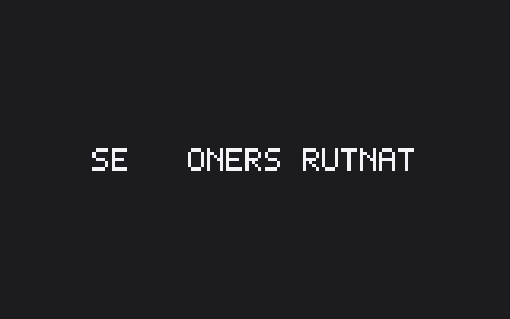
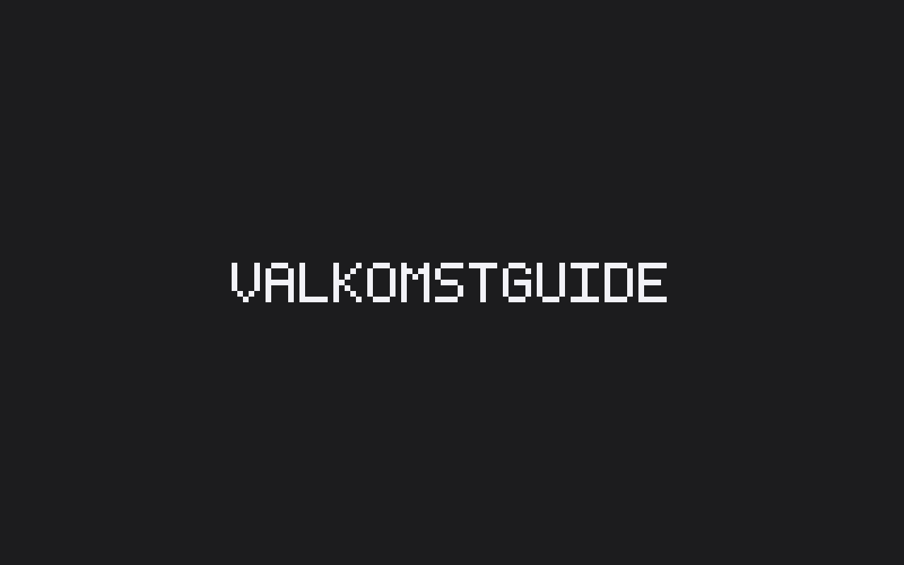
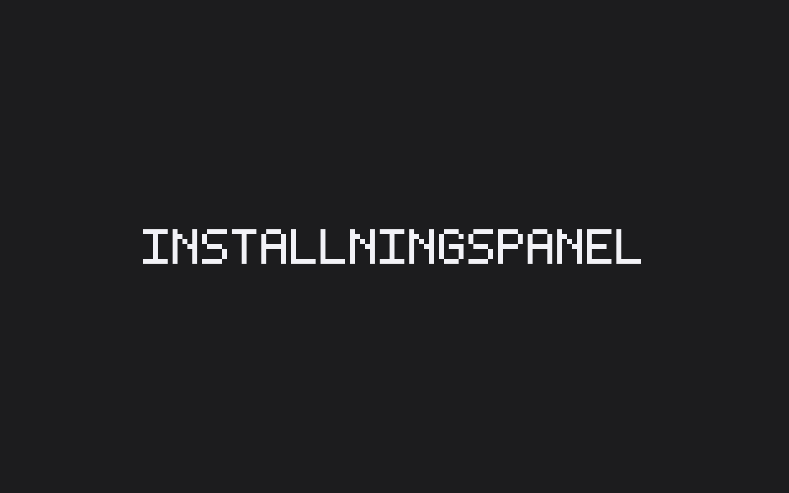

# JuraDrop

> **Privata juridiska dokument förtjänar privat AI.**
> En Mac-app som översätter, sammanfattar, anonymiserar och förenklar juridiska texter — utan att en enda bokstav lämnar din dator.

[](LICENSE)
[](#installation)
[](#status)

---

## Vad är JuraDrop?

JuraDrop är en macOS-app för svenska juridikstudenter. Dra ett Word- eller PDF-dokument till en av nio zoner i fönstret, så bearbetar en lokal AI (Ollama) dokumentet och sparar resultatet bredvid originalet.

**Nio zoner:**

| Zon | Vad den gör |
|---|---|
| **Till engelska** | Översätter svensk text till engelska |
| **Till svenska** | Översätter engelsk text till svenska |
| **Sammanfatta** | Skapar en kort sammanfattning |
| **Punktlista** | Plockar ut nyckelpunkter som listpunkter |
| **Anonymisera** | Ersätter namn, adresser och personnummer med `[Person 1]`, `[Adress 1]`, `[Personnr 1]` |
| **Förenkla** | Skriver om juridisk svenska i klarspråk |
| **Plocka ut kontaktuppgifter** | Listar namn, adresser, personnummer, telefon och e-post var för sig |
| **Generera juridisk text** | Skriver ett utkast utifrån en kort instruktion (`.txt`/`.md`) |
| **Källförteckning** | Samlar lagar, rättsfall och litteratur i en förteckning |

Varje zon har en `(?)`-ikon med en kort förklaring, och hjälp-ikonen uppe till höger öppnar en panel som listar alla nio zoner.

## Varför?

Att klistra in konfidentiella domar, klientkorrespondens eller pågående mål i ChatGPT bryter mot tystnadsplikten och kan stå i strid med GDPR. Befintliga "AI-för-studier"-guider säger åt studenter att ladda upp privilegierad information till OpenAI — det är fel.

JuraDrop löser det med arkitektur, inte löften:

- **Allt körs lokalt.** Ollama är inbäddat i appen. Modellen lever på din disk.
- **Inget innehåll lämnar datorn.** Ingen telemetri, ingen molnanalys, ingen API-nyckel som kan läcka.
- **Inget terminalstrul.** Ingen `brew install`, ingen `pip`, inget kommandoradsmys. Dra .app till Program-mappen och kör.
- **Öppen källkod (MIT).** Alla kan läsa koden och bekräfta att löftet håller.

## Status

Polish-prep inför första publika release. Specs 001–012 är klara (Tauri-bootstrap, lokal Ollama-sidecar, första dropzon, alla sex zoner, fler indataformat, signering + CI, auto-uppdaterare, välkomstguide, `.rtf`/`.pages`/`.odt`, inställningspanel, felåterhämtning, polish + beta-prep). Spec 013 (den här) utökar från sex till nio zoner, lägger till ett hjälpsystem, och fyller den nio specar gamla luckan i testtäckningen med riktiga dokumentfixturer och körbara zon-pipeline-integrationstester. Nästa steg är att tagga `v0.1.0` och låta GitHub Actions producera den första signerade DMG:n.

Huvudfönstret visar ett 3×3-rutnät av nio tematiska dropzoner: **Sammanfatta**, **Till engelska**, **Till svenska**, **Punktlista**, **Anonymisera**, **Förenkla**, **Plocka ut kontaktuppgifter**, **Generera juridisk text** och **Källförteckning**. Varje zon tar emot sju format: `.docx`, `.pdf`, `.txt`, `.md`, `.rtf`, `.pages` och `.odt`. Resultatfilen följer indataformatet där det går (`.txt` in → `.txt` ut, `.md` in → `.md` ut bevarar Markdown-strukturen). Långsvansformaten — `.rtf`, `.pages` och `.odt` — sparas alltid som `.docx`-sidofil (ingen ren Rust-skrivare finns). Moderna Apple Pages-filer (v5+, IWA-format) tas emot men kan misslyckas vid extraktion; JuraDrop säger det rakt ut med felmeddelandet `Kunde inte läsa .pages-filen` istället för att låtsas att inget hände. Appen extraherar texten lokalt, skickar den till modellen som väljs i inställningspanelen (Snabb / Smart / Stor — standardvalet är `gemma3:4b`) på `127.0.0.1:11434` med en zon-specifik svensk systemprompt, och sparar resultatet som `<originalnamn>.<zon>.<format>` bredvid originalet. Krypterade PDF:er, bildbaserade PDF:er utan textlager och korrupta långsvansfiler ger tydliga svenska felmeddelanden istället för att tyst misslyckas. Anonymisera- och Förenkla-filerna får en svensk varningstext om AI-modellens begränsningar. Om AI-sidekicken kraschar startas den om automatiskt en gång; vid en andra krasch visas svenska felet `AI-motorn svarar inte. Starta om JuraDrop.` istället för en stack trace. **Inget av dokumentinnehållet lämnar din Mac** — den enda utgående trafiken är fortfarande modellnedladdningen från `ollama.com` (en gång) och Tauri-uppdateraren. CI har dessutom en spärr som vägrar bygget om någon `sentry`/`plausible`/`posthog`/etc. dyker upp bland beroendena. Se [`specs/INDEX.md`](specs/INDEX.md) för spec-historiken.

### Skärmdumpar

> Bilderna nedan är platshållare som ersätts med riktiga skärmdumpar vid `v0.1.0`-taggen.

| Zonrutnätet (mörkt läge) | Välkomstguide (modellnedladdning) | Inställningspanel |
|---|---|---|
|  |  |  |

Releasekedjan är automatiserad: en `git push --tags` på `vX.Y.Z` triggar GitHub Actions, som bygger en universal `.app`, signerar med Developer ID, notariserar via Apple och laddar upp en signerad DMG som ett utkast under [Releases](https://github.com/johanolofsson72/juradrop/releases). Utkastet publiceras manuellt efter en smoke-test på en ren Mac. Inbyggd Tauri-uppdaterare hämtar nya versioner med signaturverifiering.

## Installation

> JuraDrop v0.1 är under utveckling. När första signerade DMG:n publicerats finns den under [Releases](https://github.com/johanolofsson72/juradrop/releases/latest).

Installationsflöde när första utgåvan finns:

1. Hämta `JuraDrop_x.y.z_universal.dmg` från [Releases](https://github.com/johanolofsson72/juradrop/releases/latest).
2. Öppna DMG-filen genom att dubbelklicka — ingen Gatekeeper-varning eftersom appen är signerad och notariserad av Apple.
3. Dra `JuraDrop.app` till `Program`.
4. Starta appen från Program. Vid första start laddas en AI-modell (~2 GB) ner från `ollama.com`.
5. Klart — dra ett dokument till en zon.

## Auto-updater

JuraDrop letar efter nya versioner cirka var fjärde timme medan appen är öppen. När en uppdatering finns dyker en liten knapp upp uppe till höger — ingen modal som blockerar arbetet. Klicka för att se vad som är nytt och tryck **Installera nu** för att hämta. Signaturen verifieras lokalt innan något skrivs till disk. När nedladdningen är klar väljer du själv när omstarten ska ske; om en zon fortfarande jobbar väntar appen tills jobben är klara innan den startar om. Bekräftelseflödet kör enbart utgående trafik mot `api.github.com` (manifestet) och `objects.githubusercontent.com` (DMG-binären) — Principle I (allt dokumentinnehåll stannar lokalt) gäller fortfarande.

Om du inte vill bli störd just nu finns en × som döljer indikatorn tills nästa version dyker upp. En diskret tidsstämpel längst ner till höger visar när senaste sökningen gjordes, och en knapp där kör en manuell sökning om du föredrar det framför den automatiska kontrollen.

## Build from source

For contributors and the curious. End-users should wait for a release rather than building from source.

### Prerequisites

- macOS 12 (Monterey) or later, Apple Silicon
- [Xcode Command Line Tools](https://developer.apple.com/) — `xcode-select --install`
- [Node 20+](https://nodejs.org/) — via `nvm` or Homebrew
- [Rust toolchain](https://rustup.rs/) — `curl --proto '=https' --tlsv1.2 -sSf https://sh.rustup.rs | sh`
- The Apple Silicon Rust target — `rustup target add aarch64-apple-darwin`

### Clone and run

```bash
git clone https://github.com/johanolofsson72/juradrop.git
cd juradrop
npm install
bash scripts/fetch-ollama.sh   # one-time: pulls the pinned Ollama binary (~75 MB) into src-tauri/binaries/
npm run tauri dev              # opens the dev window
```

`fetch-ollama.sh` is required before `npm run tauri dev` because JuraDrop bundles Ollama as a Tauri sidecar — without the binary at `src-tauri/binaries/ollama-aarch64-apple-darwin`, the app launches with the "AI-motorn kunde inte starta" error state. The script verifies a pinned SHA-256, so it's safe to re-run and will exit cleanly if the binary is already present. CI fetches the binary automatically as part of the release workflow.

### Production build

```bash
bash scripts/fetch-ollama.sh   # same prerequisite as `tauri dev`
npm run tauri:build            # produces src-tauri/target/aarch64-apple-darwin/release/bundle/macos/JuraDrop.app
```

Local production builds are unsigned by design — `npm run tauri:build` produces a `.app` that macOS Gatekeeper will block on double-click. Right-click → Open the first time to bypass when iterating locally. The signed + notarized DMG is produced by the GitHub Actions workflow that runs on `v*.*.*` tag pushes; it bundles `fetch-ollama.sh` into the pipeline so end users never need that step.

### Verifying the toolchain

```bash
npm test                                       # vitest (frontend)
npm run lint                                   # eslint
npm run typecheck                              # tsc --noEmit
npm run test:e2e                               # playwright (stub — replaced by real Playwright smoke tests at v0.1.0)
cd src-tauri && cargo test                     # Rust unit tests
cd src-tauri && cargo clippy -- -D warnings    # Rust lints
cd src-tauri && cargo fmt -- --check           # Rust format check
```

Every command should exit 0 on a clean checkout.

For signing and notarization configuration, see [`.claude/docs/deployment.md`](.claude/docs/deployment.md).

## Tech stack

- **Tauri 2.x** — Rust core + WKWebView UI
- **React 18 + TypeScript + Tailwind + shadcn/ui** — frontend
- **Ollama** (bundled as Tauri sidecar) — local LLM runtime
- **Default model**: `gemma3:4b` or `llama3.2:3b` (~2–3 GB, downloaded on first launch)

See [`PROJECT-BRIEF.md`](PROJECT-BRIEF.md) for the full architecture and [`/.specify/memory/constitution.md`](.specify/memory/constitution.md) for the project's nine governing principles.

## Privacy guarantees

The only network traffic JuraDrop makes:

1. **App updater** — pulls a signed update manifest from `github.com/johanolofsson72/juradrop/releases`. No user content involved.
2. **Initial model download** — pulls the chosen Ollama model from `ollama.com` on first launch or model change. No user content involved.

That's it. No analytics, no crash reports that include document text, no cloud LLM fallback, no "anonymous usage statistics", no `phone-home-just-this-once`. Adding any new outbound network call requires a constitutional amendment, not a code review — see [Principle I of the constitution](.specify/memory/constitution.md).

## Documentation map

| File | Purpose |
|---|---|
| [`README.md`](README.md) | You are here |
| [`PROJECT-BRIEF.md`](PROJECT-BRIEF.md) | Architecture, target users, decisions, risks |
| [`.specify/memory/constitution.md`](.specify/memory/constitution.md) | Nine governing principles (privacy, zero-CLI, native feel, …) |
| [`design-system/MASTER.md`](design-system/MASTER.md) | Colors, typography, motion, the nine drop zones |
| [`specs/INDEX.md`](specs/INDEX.md) | Spec register — what's planned, in order |
| [`.claude/docs/deployment.md`](.claude/docs/deployment.md) | Apple Developer setup, signing, notarization, CI |
| [`CLAUDE.md`](CLAUDE.md) | Working instructions for Claude Code in this repo |

## Contributing

Contributions welcome — but every change must respect the constitution, especially Principle I (Privacy by Architecture). PRs that add cloud calls, telemetry that captures user content, or outbound traffic of any kind will be rejected on principle, not negotiated.

Before opening a PR:
- Read [`.specify/memory/constitution.md`](.specify/memory/constitution.md).
- Read [`CLAUDE.md`](CLAUDE.md) for the workflow conventions.
- Run `npm test`, `cd src-tauri && cargo test`, and the Playwright smoke suite locally.

## License

MIT — see [`LICENSE`](LICENSE).

Built by [Johan Olofsson](https://github.com/johanolofsson72) with [Claude Code](https://claude.com/claude-code).
