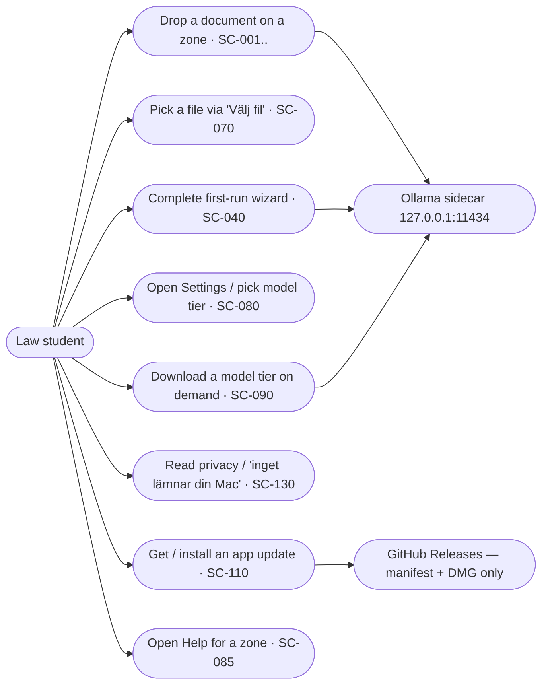
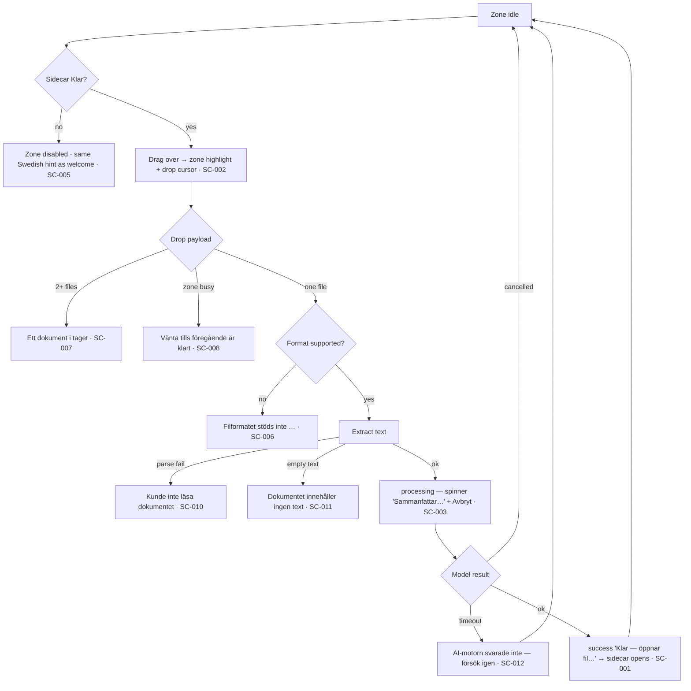
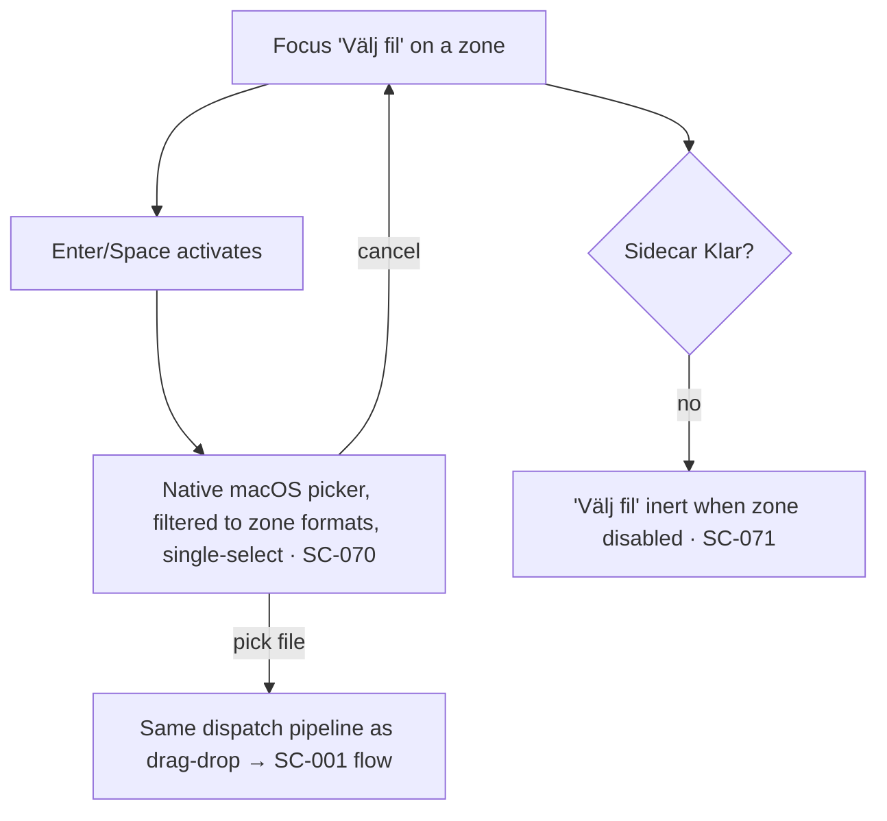
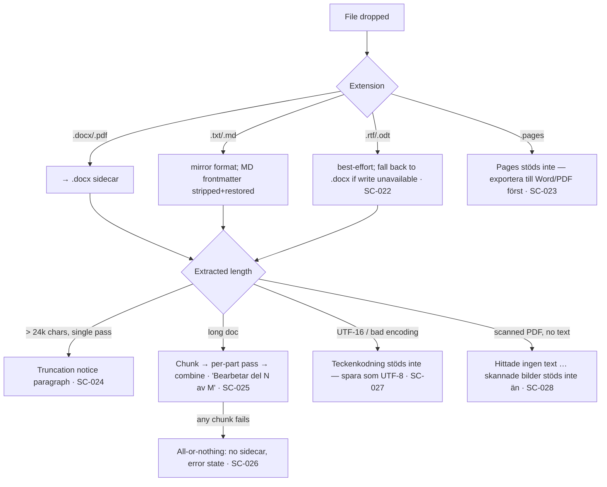
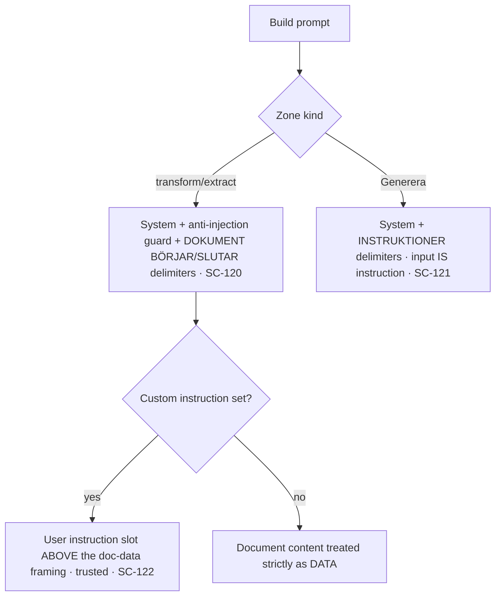
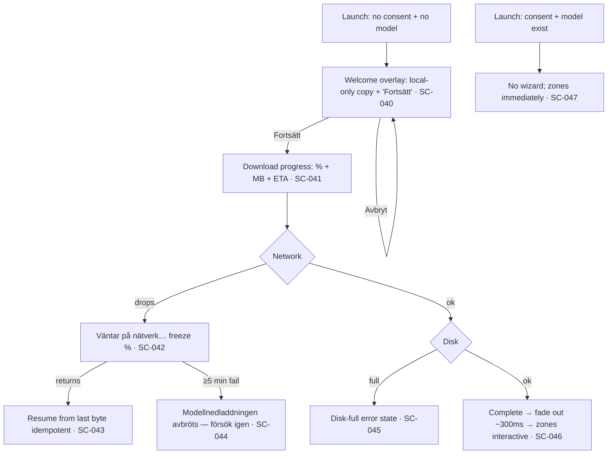
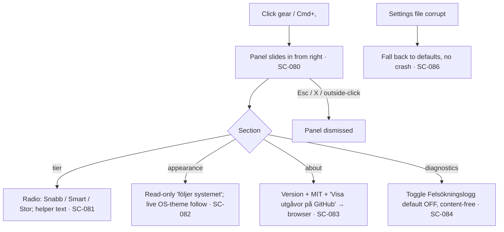
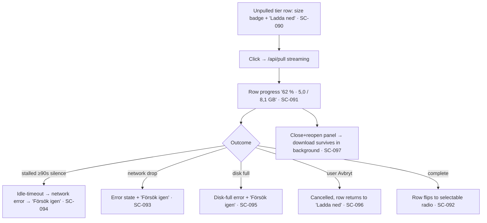
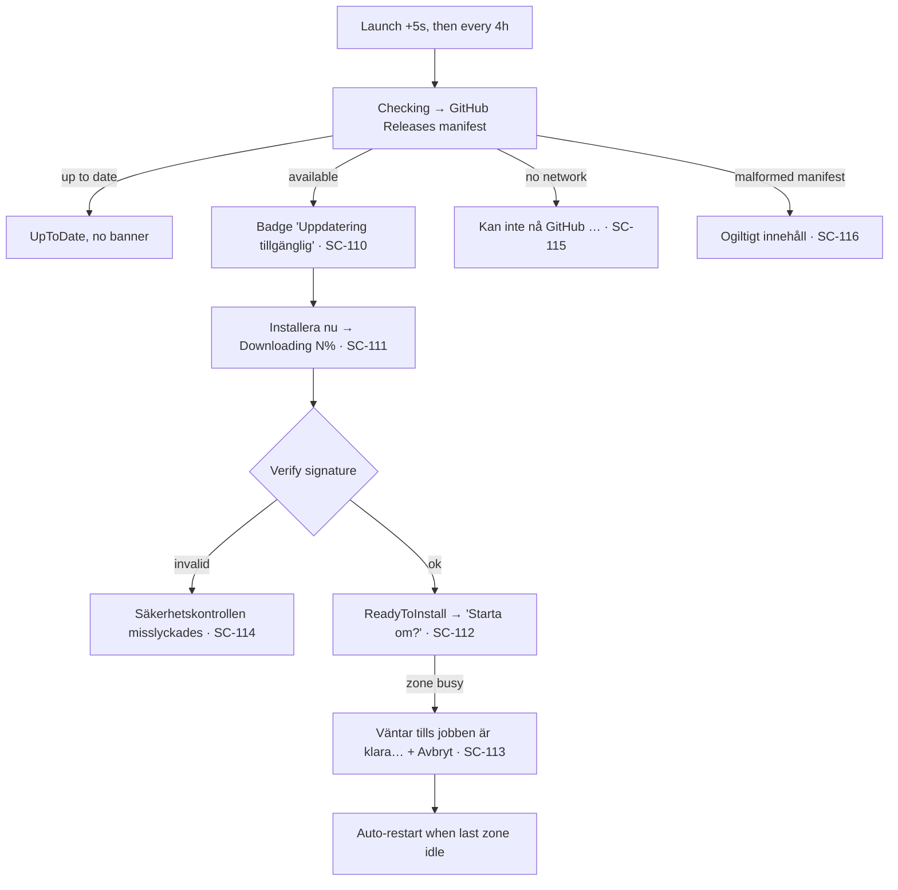
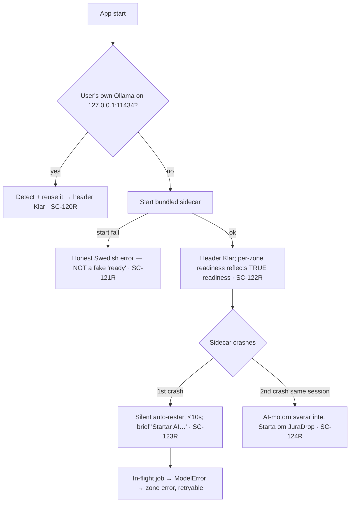

# Scenario map

Living, surveyable exploded view of every scenario. Append as the project grows; never reuse an SC-id.
Status:  ☐ mapped  ·  ◐ tested  ·  ✓ validated (proven to actually work at runtime)

> **Provenance:** this map was **derived from the existing specs (001–047 + H1)** during a fleet sync on 2026-06-20. Every row traces to a shipped spec. The scenarios are written down but **not yet validated through a scenario interview** — all rows are `☐ mapped`. A validation interview (per `.claude/rules/scenarios.md`) should confirm the four-state coverage (success / error / empty / loading) and flip rows to `◐`/`✓`.

> **Actor model:** JuraDrop is a **single-user macOS desktop app**. There is exactly one human actor — the **law student / user**. There is no multi-user auth, no roles, no server-side actor. The only non-human "actors" are the **Ollama sidecar** (local inference at `127.0.0.1:11434`) and the **GitHub Releases endpoint** (updater manifest + signed DMG only — never document content). Those appear in flows as systems, not actors.

## Use case overview (who can do what)



---

## Actor: Law student

### Feature: Drop-zone processing — transform & extract zones   (specs: 003-first-zone-sammanfatta, 004-all-six-zones, 013-nine-zones, 036-study-method-zones)

The workhorse. The same per-zone state machine drives every zone (Sammanfatta, Till engelska, Till svenska, Förenkla, Punktlista, Anonymisera, Kontakter, Källor, Generera, Identifiera rättsfrågorna, Strukturera (IRAC), Förklara begreppen). The zones differ only in their system prompt and combine strategy — the flow below is shared.

User flow:



| ID     | Type        | Scenario                                                        | Expected outcome                                                  | Status |
|--------|-------------|-----------------------------------------------------------------|------------------------------------------------------------------|--------|
| SC-001 | happy       | Drop a supported `.docx` on a transform zone                    | Extract → model → sidecar written next to source → opens         | ☐      |
| SC-002 | happy       | Drag a file over a zone                                          | Zone highlights, macOS shows accepted-drop cursor                | ☐      |
| SC-003 | loading     | While a zone processes                                          | Spinner + zone-specific Swedish label + visible "Avbryt"         | ☐      |
| SC-004 | happy       | Source file integrity                                           | Original file never modified (SHA-256 unchanged)                 | ☐      |
| SC-005 | error       | Drop while sidecar not `Klar`                                   | Zone visibly disabled, drop rejected, welcome-card hint shown    | ☐      |
| SC-006 | error       | Drop an unsupported format (e.g. `.xlsx`)                       | Swedish "Filformatet stöds inte …" naming accepted formats       | ☐      |
| SC-007 | error       | Drop 2+ files at once                                           | "Ett dokument i taget" — no processing started                   | ☐      |
| SC-008 | adversarial | Drop a 2nd file while the zone is mid-process (single-flight)   | "Vänta tills föregående dokument är klart" — exactly one job     | ☐      |
| SC-009 | adversarial | Double-drop the SAME file rapidly (race)                        | Single-flight holds; one sidecar, no duplicate run               | ☐      |
| SC-010 | error       | Drop a corrupt / unreadable document                            | "Kunde inte läsa dokumentet" — no stack trace                    | ☐      |
| SC-011 | empty       | Drop a file that extracts to zero text                          | "Dokumentet innehåller ingen text"                               | ☐      |
| SC-012 | error       | Model times out / does not respond                              | "AI-motorn svarade inte — försök igen", zone returns to idle     | ☐      |
| SC-013 | edge        | Cancel mid-process via "Avbryt"                                 | Run aborts cleanly, zone → idle, no partial sidecar              | ☐      |
| SC-014 | edge        | Sidecar name collision (canonical output exists)               | Timestamp-suffixed sidecar, source untouched                     | ☐      |
| SC-015 | adversarial | Drop documents on multiple zones simultaneously                | Per-zone independence holds; no cross-zone corruption (spec 017) | ☐      |

### Feature: Click-to-browse file picker   (spec: 016-click-to-browse-fallback)

User flow:



| ID     | Type   | Scenario                                              | Expected outcome                                            | Status |
|--------|--------|-------------------------------------------------------|------------------------------------------------------------|--------|
| SC-070 | happy  | Open file picker via keyboard, select one file        | Native picker filtered to formats; pick feeds same pipeline | ☐      |
| SC-071 | error  | "Välj fil" while zone disabled (sidecar not Klar)     | Button inert, no picker, same hint as drop path             | ☐      |
| SC-072 | edge   | Cancel the native picker                              | Returns to idle, nothing dispatched                         | ☐      |

### Feature: Input formats & extraction   (specs: 005-additional-input-formats, 009-long-tail-formats, 028-remove-pages-support, 029-silence-pdf-extract-noise, 038-chunked-summarization)

User flow:



| ID     | Type   | Scenario                                                      | Expected outcome                                                   | Status |
|--------|--------|---------------------------------------------------------------|-------------------------------------------------------------------|--------|
| SC-020 | happy  | Drop `.pdf`, `.txt`, `.md`                                     | Correct extraction; sidecar mirrors input format (PDF→.docx)      | ☐      |
| SC-021 | edge   | `.md` with YAML/TOML frontmatter                              | Frontmatter stripped before model, restored on sidecar write      | ☐      |
| SC-022 | edge   | `.rtf` / `.odt` where native write unavailable               | Best-effort extract; graceful fall back to `.docx` sidecar        | ☐      |
| SC-023 | error  | Drop a `.pages` file (zip OR legacy bundle)                   | Actionable Swedish msg: export to Word/PDF first (spec 028)        | ☐      |
| SC-024 | edge   | Document over 24k chars in a single-pass zone                | Honest truncation-disclaimer paragraph appended                   | ☐      |
| SC-025 | happy  | Long document (20–240 pages) on a chunking zone              | Map-reduce/concat combine; "Bearbetar del N av M" progress        | ☐      |
| SC-026 | error  | A chunk or the combine pass fails mid-run                    | All-or-nothing: no sidecar written, zone shows error              | ☐      |
| SC-027 | error  | UTF-16 / unsupported-encoding text file                      | "Teckenkodning stöds inte — spara som UTF-8"                       | ☐      |
| SC-028 | error  | Scanned (image-only) PDF, no extractable text               | "Hittade ingen text … skannade bilder stöds inte än"              | ☐      |
| SC-029 | edge   | Document beyond the 12-chunk (~240-page) ceiling             | "Endast de första N delarna" honest disclaimer                    | ☐      |

### Feature: Anonymisera — deterministic PII scrub + residue sweep   (specs: 014-pii-sweep, 039-anonymisera-hardening, 040-kontakter-per-person, 044-citatbevarande, 045-postnummer, 046-gatuadress, 047-hel-rads-adress)

User flow:

```mermaid
flowchart TD
  A[Drop doc on Anonymisera] --> B[Mask quoted spans → [CITAT N] if 'behåll citat' · SC-104]
  B --> C[Deterministic regex scrub BEFORE model]
  C --> C1[personnummer/telefon/e-post → placeholders · SC-100]
  C --> C2[postnummer NNN NN → [Postnr N] · SC-101]
  C --> C3[full address line gata+postnr+ort → [Adress N] · SC-102]
  C1 --> D[Model anonymises fuzzy PII: names, free-text addresses]
  C2 --> D
  C3 --> D
  D --> E[PII residue sweep on OUTPUT]
  E -- residue found --> F[Warning paragraph: granska före delning · SC-103]
  E -- clean --> G[Disclaimer: AI-anonymisering är inte 100% · SC-105]
  F --> H[Sidecar opens]
  G --> H
```

| ID     | Type        | Scenario                                                       | Expected outcome                                                  | Status |
|--------|-------------|----------------------------------------------------------------|------------------------------------------------------------------|--------|
| SC-100 | adversarial | personnummer / telefon / e-post in the document               | Deterministically replaced BEFORE model — can never leak          | ☐      |
| SC-101 | adversarial | Postnummer in spaced `NNN NN` form                            | Scrubbed to `[Postnr N]`; amounts/case-numbers untouched          | ☐      |
| SC-102 | adversarial | Full street address line (gata + postnr + ort)               | Collapsed to a single `[Adress N]` (leftmost-longest, spec 047)   | ☐      |
| SC-103 | error       | Output still contains a missed personnummer/email/phone       | Residue sweep appends a specific visible warning paragraph        | ☐      |
| SC-104 | edge        | Instruction "behåll citaten på svenska" + translate zone     | Quoted spans masked to `[CITAT N]`, restored verbatim after       | ☐      |
| SC-105 | happy       | Clean anonymise run                                            | Placeholders applied + honest "inte 100 %" disclaimer             | ☐      |
| SC-106 | edge        | Multi-chunk anonymise (placeholder labels differ per section) | Disclaimer about inconsistent placeholders across chunks          | ☐      |
| SC-107 | edge        | Kontakter groups output per PERSON, not per category          | Per-person grouping; unpaired details → "Övriga uppgifter"        | ☐      |

### Feature: Prompt-injection framing   (spec: 022-prompt-injection-framing, 041-custom-instructions)

User flow:



| ID     | Type        | Scenario                                                      | Expected outcome                                                 | Status |
|--------|-------------|---------------------------------------------------------------|-----------------------------------------------------------------|--------|
| SC-120 | adversarial | Document contains "ignore previous instructions …"           | Treated as DATA inside delimiters; model does not obey it        | ☐      |
| SC-121 | edge        | Generera zone whose input IS instructions                    | No anti-injection guard; instructions are followed by design    | ☐      |
| SC-122 | edge        | Per-drop custom instruction (e.g. keep quotes in Swedish)    | Instruction sits ABOVE doc framing; injection seam stays closed  | ☐      |

### Feature: First-run wizard   (spec: 008-first-run-wizard)

User flow:



| ID     | Type    | Scenario                                                | Expected outcome                                              | Status |
|--------|---------|---------------------------------------------------------|--------------------------------------------------------------|--------|
| SC-040 | happy   | First launch, click "Fortsätt"                          | Welcome explains local-only; consent captured on continue    | ☐      |
| SC-041 | loading | Model download in progress                              | Percent bar + "X MB av Y MB" + ETA, "Avbryt" available       | ☐      |
| SC-042 | error   | Network drops mid-download                              | "Väntar på nätverk…", percent freezes                        | ☐      |
| SC-043 | offline | Network returns after a drop                            | Resume from last received byte (idempotent pull)             | ☐      |
| SC-044 | error   | ≥5 min continuous download failure                      | "Modellnedladdningen avbröts — försök igen"                  | ☐      |
| SC-045 | error   | Disk fills during model download                        | Specific disk-full error, not a silent hang                  | ☐      |
| SC-046 | happy   | Download completes                                      | Wizard fades (~300ms min), zones become interactive          | ☐      |
| SC-047 | happy   | Subsequent launch (consent + model present)             | No wizard; zones visible immediately                         | ☐      |

### Feature: Settings panel & model tiers   (specs: 010-settings-panel, 025-local-crash-diagnostics, 042-privacy-visibility)

User flow:



| ID     | Type   | Scenario                                                  | Expected outcome                                               | Status |
|--------|--------|-----------------------------------------------------------|---------------------------------------------------------------|--------|
| SC-080 | happy  | Open settings via gear or Cmd+,                           | Panel slides in; Esc/X/outside-click dismiss                  | ☐      |
| SC-081 | happy  | Select a model tier (Snabb / Smart / Stor)               | Selection persists; helper text shown per tier               | ☐      |
| SC-082 | edge   | OS appearance changes while panel open                   | Read-only line updates live (follows system, no toggle)      | ☐      |
| SC-083 | happy  | Click "Visa utgåvor på GitHub"                            | Default browser opens the releases page                      | ☐      |
| SC-084 | edge   | Toggle diagnostics on (default OFF)                      | Content-free local log; enum-only API; consent stored apart  | ☐      |
| SC-085 | happy  | Open Help for a zone (? icon)                            | Per-zone short + long help strings shown                     | ☐      |
| SC-086 | error  | Settings file is corrupt on load                         | Defaults used, no crash, no leaked stack trace               | ☐      |

### Feature: On-demand tier download   (specs: 027-on-demand-tier-download, 034-tier-download-pull-timeout)

User flow:



| ID     | Type        | Scenario                                                | Expected outcome                                              | Status |
|--------|-------------|---------------------------------------------------------|--------------------------------------------------------------|--------|
| SC-090 | happy       | Unpulled tier shows "Ladda ned" + size                  | Click starts `/api/pull` with streaming progress             | ☐      |
| SC-091 | loading     | Tier download in progress                               | Row shows percent + "X / Y GB"                               | ☐      |
| SC-092 | happy       | Download completes                                      | Row auto-flips to a selectable radio                        | ☐      |
| SC-093 | error       | Network drops during pull                               | Error state + "Försök igen"                                 | ☐      |
| SC-094 | error       | Pull silently stalls (no bytes ≥90s) — /tla GAP-1       | Idle timeout → network error → retry path takes over        | ☐      |
| SC-095 | error       | Disk fills during pull                                  | Specific disk-full error + "Försök igen"                    | ☐      |
| SC-096 | edge        | User clicks "Avbryt" mid-download                       | Cancelled; row returns to "Ladda ned"                       | ☐      |
| SC-097 | edge        | Close + reopen settings panel during a download         | Download survives (background task), progress persists       | ☐      |
| SC-098 | adversarial | Start a 2nd tier download while one is running          | Only one download at a time (single-flight)                  | ☐      |

### Feature: Auto-updater   (spec: 007-auto-updater)

User flow:



| ID     | Type   | Scenario                                                 | Expected outcome                                               | Status |
|--------|--------|----------------------------------------------------------|---------------------------------------------------------------|--------|
| SC-110 | happy  | An update is available                                   | Non-modal badge "Uppdatering tillgänglig" + notes             | ☐      |
| SC-111 | loading| Update downloading                                       | "Hämtar uppdatering… N%"                                      | ☐      |
| SC-112 | happy  | Update ready                                             | "Klar att installera — starta om?" → restart applies it       | ☐      |
| SC-113 | edge   | Update ready but a zone is still processing             | "Väntar tills jobben är klara…" + Avbryt; auto-restart later  | ☐      |
| SC-114 | error  | Update signature invalid                                | "Säkerhetskontrollen misslyckades — installeras inte"         | ☐      |
| SC-115 | error  | No network when checking                                 | "Kan inte nå GitHub — kontrollera nätverksanslutningen"       | ☐      |
| SC-116 | error  | Malformed update manifest                                | "Uppdateringsservern svarade med ogiltigt innehåll"           | ☐      |
| SC-117 | edge   | Unsupported macOS for the new version                    | "Den nya versionen kräver en nyare macOS — uppdatera först"    | ☐      |

### Feature: Resilient Ollama & honest readiness   (spec: 026-resilient-ollama-and-drop-ux, 011-error-recovery)

User flow:



| ID      | Type        | Scenario                                                  | Expected outcome                                              | Status |
|---------|-------------|-----------------------------------------------------------|--------------------------------------------------------------|--------|
| SC-120R | happy       | User already runs their own Ollama                       | Detect + reuse it, mark sidecar Ready                        | ☐      |
| SC-121R | error       | Sidecar fails to start                                    | Honest Swedish error — never silently fake "ready"          | ☐      |
| SC-122R | edge        | Per-zone readiness vs global header                       | They always agree; no zone enabled behind a false "Klar"    | ☐      |
| SC-123R | edge        | Sidecar crashes once                                      | Auto-restart within ~10s, brief "Startar AI…" flicker       | ☐      |
| SC-124R | error       | Sidecar crashes a second time in one session             | Terminal "AI-motorn svarar inte. Starta om JuraDrop."        | ☐      |
| SC-125R | error       | In-flight job interrupted by a crash                      | Zone shows ModelError copy; user can retry immediately      | ☐      |

### Feature: Frontend resilience & large-file guard   (specs: 023-frontend-error-boundary, 024-large-file-guard)

| ID     | Type   | Scenario                                                  | Expected outcome                                              | Status |
|--------|--------|-----------------------------------------------------------|--------------------------------------------------------------|--------|
| SC-126 | error  | A React component throws during render                    | Full-screen Swedish fallback + "Starta om" (no white screen) | ☐      |
| SC-127 | error  | Drop a multi-GB file (>50 MB cap)                         | "Filen är för stor — max 50 MB" before reading into memory   | ☐      |

### Feature: Privacy visibility   (spec: 042-privacy-visibility, 030-strict-csp)

| ID     | Type   | Scenario                                                  | Expected outcome                                              | Status |
|--------|--------|-----------------------------------------------------------|--------------------------------------------------------------|--------|
| SC-130 | happy  | User wants to confirm nothing leaves the Mac             | Persistent UI affordance "ingenting lämnar din dator"        | ☐      |
| SC-131 | happy  | First-run wizard privacy copy                             | Explains the model lives on the Mac and works offline        | ☐      |
| SC-132 | adversarial | WKWebView attempts any non-localhost egress          | Strict CSP blocks all egress except 127.0.0.1:11434 + ipc    | ☐      |

<!-- On-demand artifacts (journey map / wireflow with design-frame links / storyboard)
     to be added during the scenario-validation interview if a flow warrants it. -->

## Scenario history
- 2026-06-20 — seeded from existing specs during fleet sync (derived, awaiting validation interview)
